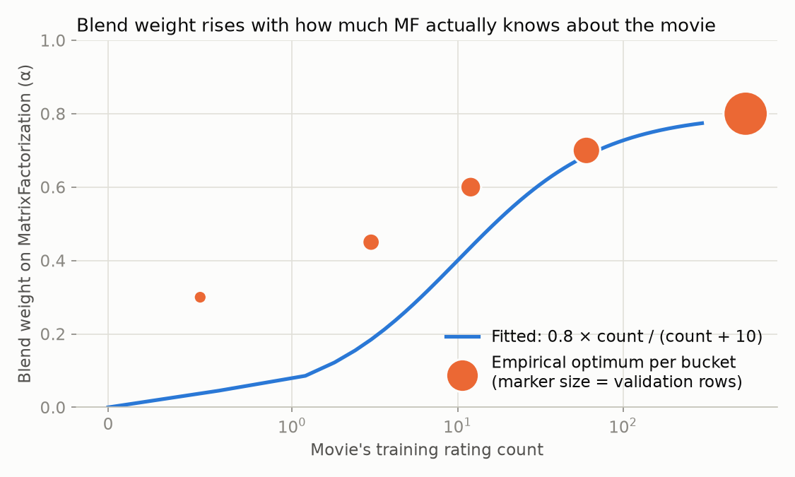
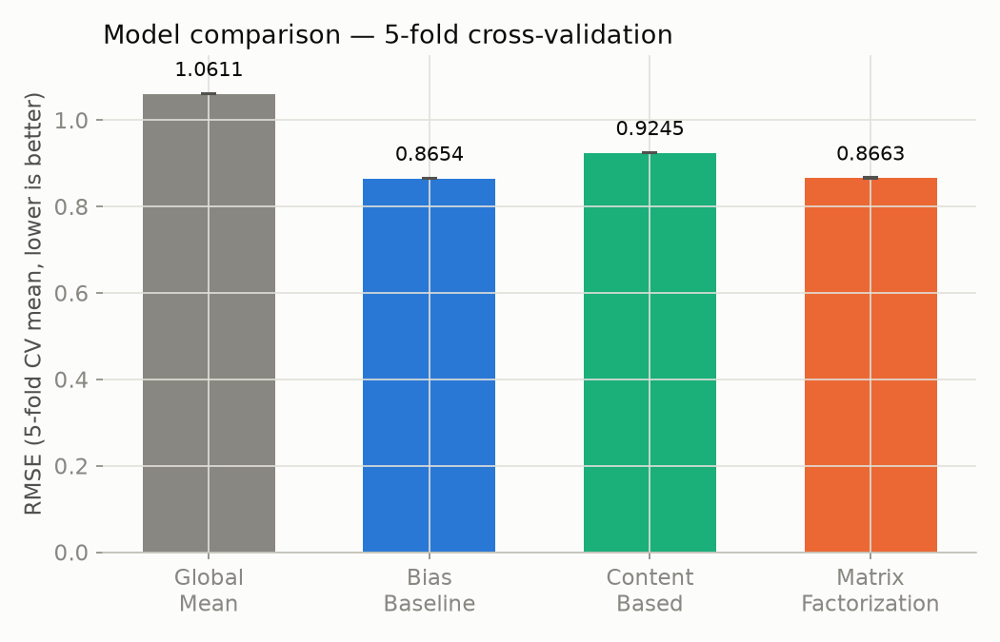
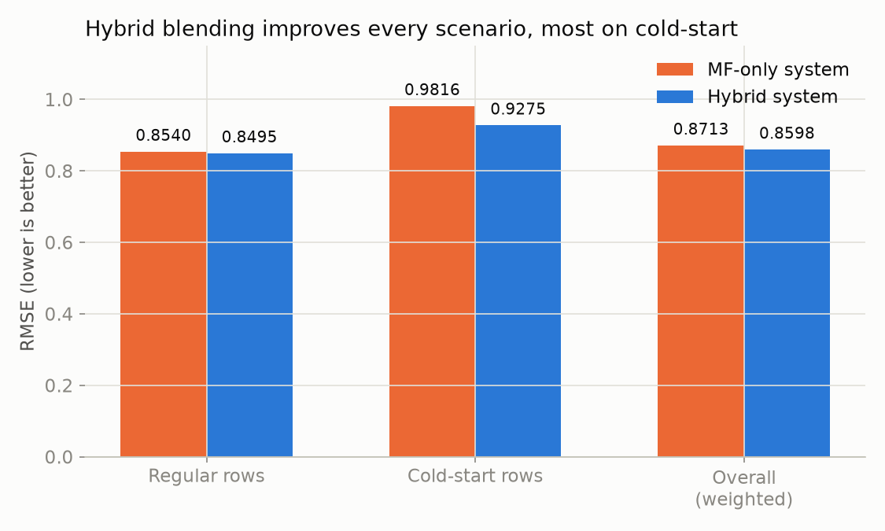

# Final Report — Movie Recommendation Kaggle Hackathon 2026

**Goal:** predict user movie ratings (0.5–5.0) to minimize RMSE, per the competition brief.
**Data:** ~10M ratings, 162,541 users, 62,423 movies (MovieLens-scale), plus movie metadata
(genres, IMDb data) and a tag genome. See `notebooks/01_eda.ipynb` for the full exploration.

## Pipeline summary

| Stage | Artifact | Outcome |
|---|---|---|
| 1. Data ingestion | `src/data_loader.py` | Downloads competition data via Kaggle API into `data/raw/` |
| 2. EDA | `notebooks/01_eda.ipynb` | 99.87% matrix sparsity; heavy long-tail in ratings-per-movie (median 4, mean 207) |
| 3. Preprocessing | `src/preprocessing.py` | `movies_features.csv` (full coverage: genres, year, IMDb metadata) + `genome_features.csv` (22% coverage) |
| 4. Modeling | `src/models.py` | Matrix factorization, content-based, and a hybrid blend (below) |
| 5. Evaluation | `src/evaluation.py` | 5-fold CV + the actual Kaggle `submission.csv` |
| 6. Reporting | this file, `figures/`, `notebooks/02_results_report.ipynb` | — |

## Models

**GlobalMeanBaseline / BiasBaseline** — reference points. BiasBaseline (`mean + user_bias +
item_bias`, fit by alternating ridge regression) is the number every fancier model needs to beat.

**MatrixFactorization** — a custom Funk-SVD-style model (`pred = mean + b_u + b_i + p_u·q_i`),
trained by mini-batch SGD with early stopping. Two real bugs surfaced and got fixed during
development: gradient updates summed (rather than averaged) across duplicate indices in a batch
caused training to diverge to NaN for popular movies, and an initial over-regularized
configuration barely beat the bias baseline until proper early stopping revealed the model was
still improving well past where it looked converged.

**ContentBasedModel** — Ridge regression on movie genres/year/runtime/budget plus the user's own
taste profile (their overall average, and their average per genre, shrunk toward it). Needs zero
training ratings for a movie to predict on it — unlike matrix factorization — so it covers the
item cold-start gap: **12.7% of `test.csv`'s movies never appear in `train.csv` at all**. Two bugs
here too: a collinearity blowup (two near-duplicate features let Ridge fit a huge, near-cancelling
coefficient pair that matched training noise and scored *worse than predicting the global mean for
everyone*), and target leakage (a user's own rating was leaking into its own feature via an
insufficiently-isolated aggregate) — both fixed and verified before trusting the results below.

**HybridModel** — blends the two, weighted by how many training ratings the target movie had
(`alpha = 0.8 · count / (count + 10)`) — near-zero weight on MatrixFactorization for cold/sparse
movies, rising to 80% for well-established ones. The weight curve is grounded in a grid search of
the optimal blend per rating-count bucket on held-out data, not guessed:

## Evaluation

5-fold row-level cross-validation (`src/evaluation.py`), the same split shared across models for a
fair comparison:

| Model | CV mean RMSE | std |
|---|---|---|
| Global mean | 1.0611 | 0.0006 |
| Bias baseline | 0.8654 | 0.0005 |
| Content-based | 0.9245 | 0.0006 |
| Matrix factorization | 0.8663 | 0.0022 |

All low-variance across folds — these aren't lucky splits. Content-based alone scores worse than
the bias baseline here, which is expected: on *regular* rows it has no per-item learned factor,
only metadata. Its real value shows up on the rows matrix factorization structurally can't handle:

| Scenario | MF-only system | Hybrid system |
|---|---|---|
| Regular rows | 0.8540 | 0.8495 |
| Cold-start rows (12.7% of movies, unseen in training) | 0.9816 | 0.9275 |
| **Overall** (weighted to match `test.csv`'s real composition) | **0.8713** | **0.8598** |

The hybrid blend improves RMSE in every scenario, most dramatically on cold-start rows (~5.5%
relative) — exactly the gap it was built to close — and still measurably on regular rows (~0.5%),
where content-based apparently captures some genre/year signal matrix factorization's per-item
factors don't fully absorb for sparser movies. Overall: **a ~1.3% relative RMSE improvement** over
matrix factorization alone.

## Final submission

`submission.csv` (5,000,019 rows, format-verified against `sample_submission.csv`) was generated
by `HybridModel` trained on all of `train.csv`, via `src/evaluation.py:generate_submission()`.

## Limitations & future work

- **`genome_features.csv` is unused.** Only 22% of movies have tag-genome coverage; it was built
  during preprocessing but never incorporated into a model. A natural next step for movies that
  do have it.
- **HybridModel wasn't re-run through full 5-fold CV** — its reported numbers come from a single,
  separately-validated holdout (both a random-row split and a true movie-level cold-start split).
  Re-deriving cold-start-holdout numbers per CV fold was out of scope given the time already spent
  on matrix factorization's CV (~4 hours of chunked training across 5 folds).
- **The blend weight curve's middle buckets are noisy** (small validation samples); only the two
  endpoints (0 ratings, 100+ ratings) are backed by large samples. A more rigorous version would
  fit the curve's parameters directly rather than eyeballing k=10 against a bucket table.
- **No true ensembling beyond a single blend weight** — e.g. stacking a meta-model on top of both
  predictions, or blending in more signals (tags, cast/director) as additional model inputs,
  could plausibly push RMSE further.
